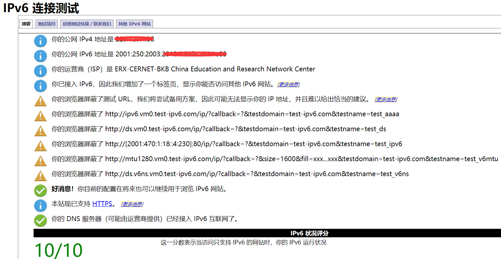

## 四川大学校园网连接IPv6脚本

### Windows 环境（Windows 7及以上系统适用）

#### 启动

- 右键 enable_ipv6.bat ，选择“以管理员身份运行”。
 

- 等待屏幕输出确认结果。

**测试**

前往 http://test-ipv6.com/



若有2001:250:2003:为前缀的IPv6地址，说明已正常连接了我校IPv6网。

以下操作为非必须。如果按照上述提示操作以后仍无法正常访问IPv6站点，可以尝试：

- 右键点击桌面“计算机”图标，选择“管理”，展开“服务和应用程序”，选择“服务”，确认“IP Helper”服务已开启；

- 确认原生IPv6已经关闭（Internet 协议版本 6 (TCP/IPv6)前的对勾取消，位置在控制面板→网络和Internet→网络和共享中心→更改适配器设置→双击本地连接→属性）；
- 尝试重启系统。

### Linux 环境

利用包管理工具安装**isatapd**，例如ubuntu下：
```bash
sudo apt install isatapd
```

然后使用isatapd：

```bash
sudo isatapd 202.115.39.98
```

保持该shell运行，ctrl + c 退出

### Mac OS X环境